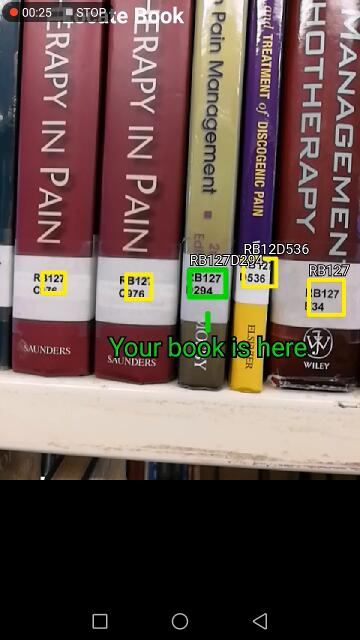

# An Android Library Book Labels Detector

## Description

This project is to implement an Android mobile application to automatically detect library book labels.  It makes use of Tensorflow Mobile and YOLO object detection algorithm.  This is also my capstone project for the Udacity Machine Learning Nanodegree.

The application accepts the text of the target book label as input, then tries to locate the book from the camera view, and displays the prompt if the book is found. The Below animated gif is a demo of how the application works.  (Currently only the "Locate Book" feature has been implemented.  )

Below is a static screenshot, in case the animated version is taking too long to load.

## Overview of Technologies Used

- Deep learning frameworks:
    - Tensorflow
    - Tensorflow Mobile (https://www.tensorflow.org/mobile/mobile_intro)
- Object detection:
    - Algorithm: YOLO (You Only Look Once) (https://pjreddie.com/darknet/yolo/)
    - Tensorflow implementation of YOLO: Darkflow (https://github.com/thtrieu/darkflow)
- Text Recognition:
    - Google ML Kit (https://developers.google.com/ml-kit/)

The detector model was trained using self collected dataset.  The mobile application was built using the Android example from Tensorflow as the base (https://github.com/tensorflow/tensorflow/tree/master/tensorflow/examples/android).

## Project Folder Structure

The mobile application source codes including the trained model file are included in "android" folder.  The rest of the folders mainly contain the Python scripts and other machine learning stuffs for training the model, which are not required if you only want to build and try out the mobile application.

- **android**: source codes of Book Label Detector Android application
- **data**: library books dataset including images and annotations
- **demo**: a video demo on Book Label Detector Android application
- **packages**: 3rd party packages required for model training.
    - cocotext: COCO-Text API tool to be downloaded from https://vision.cornell.edu/se3/coco-text-2/
    - darkflow: Python implementation for YOLO.  To be downloaded from https://github.com/thtrieu/darkflow
- **project-ml**:
    - notebooks: Jupyter Notebooks with Python scripts for the machine learning project implementation and evaluation.
- **reports**: markdown file and asset files of the report for Udacity Machine Learning Nanodegree - Capstone Project.

## Project Requirements

- Android application
    - Android Studio==3.1.3
    - Before building the project, need to connect the Android project to Firebase first.  This is the prerequisite for using ML Kit.  Refer to the instructions at https://firebase.google.com/docs/android/setup
    - Once connected to Firebase, a google-services.json file will be created in the *android* project root folder, and the project can be built.
    - Minimum Android version: 5.0

(The below are required only if you want to re-train the detector model.)

- Machine learning with Python
    - python==3.6.5
    - opencv-python==3.4.0.12
    - matplotlib==2.2.2
    - numpy==1.14.2
    - pandas==0.23.0
    - tqdm==4.23.0
    - ipykernel==4.8.2
    - tensorflow-gpu==1.6.0
    - ipywidgets==7.2.1
    - lxml==4.2.1
    - Cython==0.28.2

- Install Darkflow
    - Clone the repository from https://github.com/thtrieu/darkflow to the folder *packages/darkflow*.
    - Go to *packages/darkflow* folder and install by running the below command:
`pip install -e .`

- Download pre-trained weights for Tiny YOLO (optional)
    - Go to https://pjreddie.com/darknet/yolov2/ and download the weights yolov2-tiny-voc.weights
    - Put the weights file under *packages/darkflow/bin* folder

- Training on COCO-Text dataset (optional)
    - Download MS COCO 2014 train dataset from http://cocodataset.org/#download
    - Downlaod COCO-Text annotations from https://vision.cornell.edu/se3/coco-text-2/#download

## Credits

- Tensorflow: https://github.com/tensorflow/tensorflow
- Darkflow: https://github.com/thtrieu/darkflow
- VoTT: https://github.com/Microsoft/VoTT
