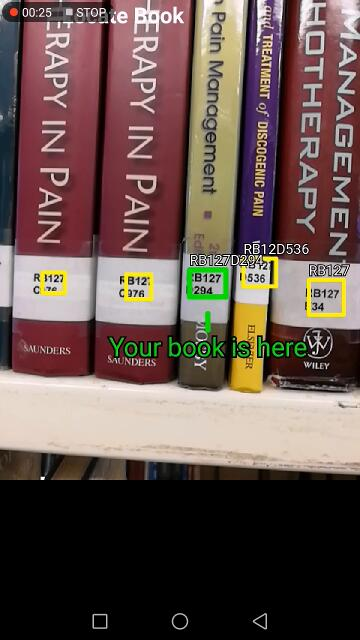

# Machine Learning Engineer Nanodegree

## Capstone Project - A Library Book Label Detector

Huang Haijie

July 18th, 2018

## I. Definition

### Project Overview

Library is a popular and important facility for reading and learning, because not all books are digitally available, and some people still prefer the feelings of reading physical books and enjoy the quiet environment.  There are easily thousands or even millions of books stored in a single library.  Managing and locating the vast amount of books usually involve tedious and manual work.  For ease of arrangement, each book is assigned a label with a number (which is referred to as "call number"), and the books are placed on the bookshelf following the order of these numbers.  Searching and locating the books are mainly based on the assigned label numbers.  This project will use machine learning technologies to automatically detect and recognize book labels on the bookshelves, and help to ease both library staffs and users in arranging and locating books.  

In recent years, there are huge progresses in deep learning researches and applications, thanks to the exploding amount of data and the increased computing power.  Convolutional Neural Network (CNN) has proven to be an efficient and effective tool to solve computer vision problems.  Object detection is one of the problem domains where CNN can become a great help.  Scene text detection is a sub category of object detection which this project is trying to target on, and CNN model will be utilized in the solution.  The completed application will work on mobile devices so that it can be used on scene.

### Problem Statement

Library books are strictly arranged by the order of the label numbers.  Library staffs and users need to scan through the book labels with naked eyes in order to arrange or locate the books, which is tedious, manual, and eye-tiring.  An application with the capability of detecting and recognizing book labels can potentially solve a number of problems in this area.  Below are a selected few tasks that such system can help.

#### Task 1: Identifying Misplaced Books

A misplaced book is difficult to locate since it is put on the bookshelf in a wrong order.  One of the routine tasks of a library staff is to do eyeball checking for each single book on the bookshelf and make sure they are in the correct order.  It is both eye-tiring and brain-tiring, since the staff needs to do mental comparison for each label number to ensure correct ordering.  With a mobile application with label detecting capability, the staff can simply use the camera on the mobile device to scan through the labels, and the application will automatically raise alert and highlight if a book is detected as misplaced.  Below is a sample mockup screenshot of how the application is supposed to locate the detected labels and highlight the misplaced book.

<div style='text-align:center'>


<b>Figure 1</b>: Mockup - Misplaced Book
</div>

#### Task 2: Identifying Correct Location to Place a Book

When a library staff or user need to return a book back to the bookshelf, she can first use the mobile application to scan in the label number of the book he is going to return, then go to the bookshelf where the book is supposed to be placed, and use the application to scan through the book labels on the bookshelf.  The application is supposed to detect the exact location where the book need to be placed.  Below is a mockup screenshot of how this will be shown.

<div style='text-align:center'>


<b>Figure 2</b>: Mockup - Insert Location
</div>

#### Task 3: Locating a Book with Given Label Number

When a library user needs to find a book, she will first search for the label number from the library catalog system.  Once the label number is found, he can go to the bookshelf where the book is supposed to be located, then use the mobile application to scan through the book labels to find the exact location of the specified book.  Refer to the below mockup screenshot.

<div style='text-align:center'>


<b>Figure 3</b>: Mockup - Locate a Book
</div>

### Metrics

For the label detection model, 2 metrics will be used to quantify the performance:

- Average Precision (AP): To evaluate the accuracy of detection.
- Frames per Second (FPS): To evaluate the speed of detection.

Average Precision is a common metric used in object detection, it is usually associated with particular Intersection over Union (IoU) thresholds.  For a detected object instance in an image, the model will predict the bounding box coordinates surrounding the object.  IoU measures how well the predicted bounding box matches or overlaps with the one in the ground truth data.  Mathematically, IoU is the ratio of the area of intersection (common area in both the prediction and ground truth bounding boxes) over the area of union (combination of the prediction and ground truth bounding boxes).  A detected object will be considered as true positive only if the IoU for that particular object instance exceeds a certain threshold.  The larger the IoU threshold, the less number of true positives will be produced, and vice versa.  0.5 is a reasonable threshold commonly used in object detection.

<div style='text-align:center'>


<b>Figure 4</b>: IoU
</div>

Precision is the ratio of true positives over all predicted positives.  Recall is the ratio of true positives over all ground truth positives.  An object detection model will predict the level of confidence (between 0 and 1) for each detected instance.  Whether a predicted instance is a positive detection depends on the threshold of confidence level being set.  When the confidence threshold increases, the precision increases (since the model will only predict an instance as positive if it is very certain), but the recall will decreases (since the prediction has higher chance to miss out some ground truth positives).  The Average Precision will be obtained by calculating the area under the precision-recall curve.  According to the definition specified in Pascal VOC 2012 Challenge [[1](http://host.robots.ox.ac.uk/pascal/VOC/voc2012/htmldoc/devkit_doc.html#sec:ap)], the AP is computed as below:

> 1. Compute a version of the measured precision/recall curve with precision monotonically decreasing, by setting the precision for recall r to the maximum precision obtained for any recall r' >= r
> 2. Compute the AP as the area under this curve by numerical integration. No approximation is involved since the curve is piecewise constant.

The mAP is the mean of average precision across all the object classes.  In the text detection problem, since there is only 1 object class, the mAP will be the same as AP.
 AP is a performance metric which takes both precision and recall into consideration, it is widely used in object detection challenges and evaluations, hence it is suitable for our text detection problem.

FPS is the frame rate which measures the detection speed.  It is the inverse of the time required to finish the prediction for 1 image.  Detection speed does not only depend on the efficiency of the model, it also depends on the platforms and hardwares being used.  The FPS of the benchmark model will only be used as a soft reference, since we are not using the same hardware configurations.  We will still target to achieve an FPS of 24, since this is the common frame rate used in movies, above which no obvious lagging will be perceived by human eyes.  We should consider the AP as the main evaluation metric for the detection model.

## II. Analysis

### Data Exploration

Detecting book label is essentially a scene text detection problem, which is a sub category of object detection in computer vision.  There are quite a number of publicly available datasets for object detection, e.g., ImageNet, MS COCO [[2](http://cocodataset.org/)], Pascal VOC, etc.  These are general purpose object detection datasets, with the number of object classes ranging from 20 to over 20k.  The datasets dedicated for text detection is rather limited.  One of the largest public datasets for text detection is COCO-Text [[3](https://vision.cornell.edu/se3/coco-text-2/)], which is based on the images from MS COCO, and provides annotations only for text objects.  COCO-Text annotations 2017 v1.4 covers *63,686* images with *145,859* text instances.  The dataset is divided into training, validation and test sets as below with approximate ratio of 4:1:1.

Train | Validation | Test
--- | --- | ---
43,686 | 10,000 | 10,000

Since the object annotations for the test set is not publicly available, we only used the training and validation sets.

The entire COCO-Text annotation is 1 single json file containing the below 3 sections:
- info: version and description of the annotations.
- imgs: images information including image ID, file names from the MS COCO dataset, whether the images belong to train/val/test sets, etc.
- anns: annotations of all text instances.

Each instance annotation includes the below information.

- class: 'machine printed' or ' handwritten' or 'others'.
- legibility: 'legible' or 'illegible'.
- language: 'english' or 'not english' or 'na'.
- bbox: [x,y,width,height], coordinates and size of the bounding box enclosing the text.
- utf8_string: content of the text.
- polygon: coordinates of the bounding polygons.

Below is an extracted sample from the COCO-Text json file with 1 image and 1 annotation.

```json
{"imgs": {
    "378466": {
        "width": 612, 
        "file_name": "COCO_train2014_000000378466.jpg", 
        "set": "train", 
        "id": 378466, 
        "height": 612
        },
    ...
    },
"anns": {
    "1231468": {
        "polygon": [
            380.57979575247066,
            581.7662670169573,
            415.1992437528803,
            581.7662670169573,
            415.1992437528803,
            610.5664198710294,
            380.57979575247066,
            610.5664198710294
        ],
        "language": "english",
        "area": 997.0453941354001,
        "id": 1231468,
        "utf8_string": "BUSM",
        "image_id": 10581,
        "bbox": [
            380.57979575247066,
            581.7662670169573,
            34.61944800040967,
            28.800152854072127
        ],
        "legibility": "legible",
        "class": "machine printed"
        },
    ...
    },
}
```

For this project, only annotations with "legible" and "machine printed" class will be used for training and validation.  Below shows the number of images and relevant annotations per set.

 Type | Train - Images| Validation - Images| Train - Annotations| Validation - Annotations
--- |--- | --- | --- | ---
Legible & Printed |	14,324 | 3,346 | 65,720 | 15,127
Others | 29,362 | 6,654 | n.a. | n.a.

The maximum width and height of the COCO-Text images are 640px, which are reasonable sizes for training and inference.

Such dataset will be useful for training a CNN model whose primary task is to detect text labels, and the amount of images and annotations is large enough to make the model achieve good text feature extractions and generalized predictions.  However, such dataset alone is not sufficient.  In our problem, using a generic text detector will potentially generate a lot of false positives, because the titles and other texts on the books will also be detected, but what we want are only the book labels.  Hence, we need another set of self-collected images which are purely on library bookshelves, with text instance annotations on the book labels alone, ignoring all other texts.  In the first round, *192* images were taken from library bookshelves using mobile phone camera.  Half of the images are without book labels such that the training will help the model reduce the number of false positives.  The collected images are divided into training, validation and test sets with the ratio of 4:1:1.  The training set is used for training.  The validation set is used to validate the intermediate model performance at milestone checkpoints.  The test set is used to do one last round of evaluation after the model and weights have been finalized.  Below summarizes the number of images in each set.

Set | Train | Validation | Test
--- | --- | ---| ---
With Book Labels | 64 | 16 | 16
Without Book Labels | 64 | 16 | 16
**Subtotal** | **128** | **32** | **32**

### Exploratory Visualization

#### COCO-Text

COCO-Text images are taken from MS COCO dataset, and the annotations specify the rectangular boundaries of each text instance.  Below is a sample image with the respective bounding boxes from COCO-Text.

<div style='text-align:center'>


<b>Figure 5</b>: COCO-Text Sample
</div>

Among those images with legible and machine-printed texts, the number of text instances per image ranges from 1 to 209.  Below shows the distribution of the text instance counts.

<div style='text-align:center'>


<b>Figure 6</b>: Histograms of COCO-Text Instance Counts
</div>

The mean of the number of text instances per image is 4.5, which indicates that the occurrence of text in majority of the images is sparse.  This makes the job of text detection a bit easier, because some object detection models have difficulty detecting dense and clustered object instances.

The complete scripts for data exploration and preprocessing can be found in the notebook *project-ml/notebooks/01_data-exploration-preprocessing.ipynb*.

#### Self-collected Library Books Images

Due to time and resource limits, only a small amount of library books images were collected.  Considering the relatively simple use cases and semi-constraint environment, the images of library books do not have much variance, the small amount of dataset would still be sufficient for training an acceptable book label detector.  Below is a sample of a collected image with the annotated bounding boxes on book labels.

<div style='text-align:center'>


<b>Figure 7</b>: Library Books Sample
</div>

Below histograms illustrate the distribution of the book labels count per image.  The mean of the book labels count per image is 5.5.

<div style='text-align:center'>


<b>Figure 8</b>: Histograms of Library Book Label Counts
</div>

The complete library books images together with the annotations can be viewed using the notebook *project-ml/notebooks/02_data-exploration-librarybooks.ipynb*.

### Algorithms and Techniques

The entire solution can be broken down into 3 parts.  First, a CNN based label detector which detects the bounding box coordinates of all the book labels in the input images or video.  Second, after the book labels are detected, each individual label will be cropped out based on the detected bounding box, and fed into a text recognition module which will output the actual content of the label (e.g., 'RG26Y39').  Third, the detected book labels and contents will be processed by the application logics which generates outputs based on user selected task, e.g., to highlight the misplaced book, or to highlight the book which the user is searching for, etc.  Solutions for each part are explained in further details below.

#### CNN Based Label Detector

For image classification, there are a good number of CNN models which can achieve great results, e.g., VGG, GoogleNet / Inception, ResNet, etc.  Object detection is slightly more complicated than image classification in the below aspects.

- Besides predicting the class of object represented in an image, an object detector also needs to detect the coordinates of bounding box surrounding the object.
- An object detector needs to detect multiple instances of objects in a single image instead of only 1 instance.

CNN based object detection models usually use classification models as bases for feature extraction and object class identification.  On top of that, additional layers are incorporated to predict the coordinates of the bounding boxes.  There are a number of popular object detection models which can be categorized into 2 groups based on the different approaches and architectures. [[4](http://cs231n.stanford.edu)]

- Detection based on region proposals.  This approach relies on region proposal algorithms (either traditional computer vision techniques or CNN) to generate a set of regions potentially containing objects, and pass each region to CNN for classification and bounding box prediction.  Such approach is usually slow, due to multiple passes required in processing the image, but could result in higher accuracy.  Popular models under this category include R-CNN, Fast R-CNN, Faster R-CNN, etc.
- Single pass detection.  This approach performs both object classification and bounding box prediction in a single pass without any region proposal.  This approach is fast, but could be less accurate.  Popular models include **YOLO (You Only Look Once)**[[5](https://pjreddie.com/darknet/yolo/)], SSD (Single Shot MultiBox Detector)[[6](https://arxiv.org/abs/1512.02325)], etc.

Since our model is supposed to be run on mobile devices with constraint computing power, we decided to use a single pass model as the base for its fast speed and light weight architecture.  Comparing between the 2 popular single pass detectors: YOLO and SSD, the former is chosen due to the below considerations.

- Performance.  According to the results published on [[5](https://pjreddie.com/darknet/yolo/)], YOLO outperforms SSD in both accuracy and speed.
- Ease of configuration and customization.  YOLO implementation allows the network architecture to be defined in a single plain text configuration file, whereas customization on SSD (using Tensorflow Object Detection API [[7](https://github.com/tensorflow/models/tree/master/research/object_detection)]) requires programing in Python and Tensorflow.

YOLO treats object detection as regression problem, predicting bounding box coordinates and object class probabilities in a single neural network.  It divides an input image into `S x S` number of grid cells.  For each grid cell, `B` number of anchor boxes with different sizes and aspect ratios are defined.  Each object instance is assigned to 1 anchor box which is "responsible" for predicting that object.  Each anchor box will predict the probabilities for `C` number of object classes,  and 5 values specifying the bounding box which are shown as below.

- x, y: coordinate of the predicted bounding box center relative to the grid.
- width, height: size of the bounding box relative to the entire image.
- confidence: level of confidence for the predicted object instance.

Summing them up, the total number of output values from the YOLO network is `S x S x B x (5 + C)`.

A brief detection pipeline with 13 x 13 grid cells is illustrated below.

<div style='text-align:center'>


<b>Figure 9</b>: YOLO Object Detection
</div>

The training of YOLO is an end-to-end process updating all 3 components (feature extraction, object localization and object classification) together via back propagation.  The loss function is defined as the sum of squared errors with the below 5 components:

- Error of (x,y) coordinates of bounding box centers.
- Error of widths and heights of bounding boxes.
- Error of confidence for the responsible anchor boxes.
- Error of confidence for the non-responsible anchor boxes.
- Error of object class probabilities.

The training minimizes the above errors to improve accuracies of the bounding boxes and object class probabilities together.

In general, YOLO is fast and produces less false positives because it sees the entire image and encodes contextual information, unlike other models which only look at a particular region at a time.  YOLO has a few limitations as well, but they would not pose big challenges to this project, which are discussed below.

- The granularity of YOLO's detection relies on the predefined number of grid cells, it has difficulty in detecting clusters of small objects which are close to or overlapping with each others.  This would not be a problem in our case since library book labels do not overlap.
- YOLO is not able to generalize to objects with unusual aspect ratios or configurations.  This should not worry us since there is not much variation in aspect ratio or size for book labels.
- YOLO has relatively low accuracy in predicting bounding box coordinates.  This can be overcome by postprocessing in the application logics, which will be covered in later sections.

The official YOLO implementation uses Darknet (a neural network library in C).  There is a Python port-over called Darkflow [[8](https://github.com/thtrieu/darkflow)] which converts YOLO Darknet models to Tensorflow models.  We chose the YOLO Tensorflow model as the base, modify and fine tune it via transfer learning and eventually make it become the book label detector.  In order to achieve real time performance on mobile devices, we selected the faster version (Tiny YOLO) which was pre-trained on Pascal VOC dataset.  The full YOLO includes 24 convolution layers followed by 2 fully connected layers.  Tiny YOLO has a much simplified network with only 9 convolution layers (plus batch normalization, Leaky ReLU activation and max pooling layers).  The latest version of YOLO is version 3.  We used version 2 of Tiny YOLO since version 3 is currently not available in Darkflow yet. The original Tiny YOLOv2 architecture with 20 object classes for Pascal VOC is illustrated as below.  The number of grid cells is 13 x 13 with 5 anchor boxes per cell.

No. | Layer description             | Output size
----|-------------------------------|---------------
0| input                            | (?, 416, 416, 3)
1| conv 3x3p1_1  +bnorm  leaky      | (?, 416, 416, 16)
.| maxp 2x2p0_2                     | (?, 208, 208, 16)
2| conv 3x3p1_1  +bnorm  leaky      | (?, 208, 208, 32)
.| maxp 2x2p0_2                     | (?, 104, 104, 32)
3| conv 3x3p1_1  +bnorm  leaky      | (?, 104, 104, 64)
.| maxp 2x2p0_2                     | (?, 52, 52, 64)
4| conv 3x3p1_1  +bnorm  leaky      | (?, 52, 52, 128)
.| maxp 2x2p0_2                     | (?, 26, 26, 128)
5| conv 3x3p1_1  +bnorm  leaky      | (?, 26, 26, 256)
.| maxp 2x2p0_2                     | (?, 13, 13, 256)
6| conv 3x3p1_1  +bnorm  leaky      | (?, 13, 13, 512)
.| maxp 2x2p0_1                     | (?, 13, 13, 512)
7| conv 3x3p1_1  +bnorm  leaky      | (?, 13, 13, 1024)
8| conv 3x3p1_1  +bnorm  leaky      | (?, 13, 13, 1024)
9| conv 1x1p0_1    linear           | (?, 13, 13, 125)

The input to the network will be the image or individual frame from a video with the dimension of 416 x 416 and RGB channels.  The output will be a list of bounding box coordinates and level of confidence specifying the detected book labels.

#### Label Text Recognition

The detected book labels will be cropped out from the original image based on the predicted bounding boxes, and the text recognition module will be responsible to predict the actual text content in each label.  Directly feeding the entire image to the text recognition module will not be helpful because it will include unwanted texts in the output, such as book titles, authors, etc.  In addition, it will be difficult to group the vast amount of detected texts into individual book labels.  This is the reason why we need a book label detector and only feed the detected label instances to the recognition module.

Text recognition is an OCR (Optical Character Recognition) problem.  There are a number of possible solutions as listed below.

- Out-of-the-box solutions
    - On-device solutions.  These solutions can be deployed and run on the mobile devices.
        - **Google ML Kit** [[9](https://developers.google.com/ml-kit/)]. A machine learning API for mobile applications. Currently in beta version.
        - Google Mobile Vision.  Predecessor of ML Kit.  
    - Cloud solutions.
        - Google Cloud Vision API. Image analysis API on Google Cloud.
        - MS Cognitive Services - Vision API.  Image analysis API on Azure Cloud.
        - Amazon Rekognition.  Image analysis API on Amazon Web Services Cloud.
- Custom solutions.
    - Deep Neural Networks.  Models built and trained using CNN and RNN (Recurrent Neural Network) under Tensorflow.  The trained model can be ported to mobile devices using Tensorflow Lite or Tensorflow Mobile.
    - Traditional computer vision techniques.  Algorithms developed using computer vision libraries like OpenCV.

Due to resource and time constraints of this project, we chose to utilize an out-of-the-box solution for this task.  Google ML Kit was selected for the below considerations.

- ML Kit supports on-device inference.  It makes use of mobile device's CPU to perform prediction, without the need of transferring inputs and outputs via Internet.  Although the computing power of mobile device is less than those on the cloud, this can be justified by the saving of network transmission time, especially when multiple predictions are required for a single input image.  It can work even if the device is completely offline.
- ML Kit can support custom models if the out-of-the-box model does not meet requirements.  This makes the application flexible for potential future enhancements.
- ML Kit is free for using on-device inference, whereas services on the cloud will incur charges.

ML Kit is a set of APIs based on Google Firebase.  The offline model will be downloaded from server when the mobile application is first installed.

For each book label, the model may still recognize multiple blocks or lines of texts.  The application will merge all blocks of texts from a single prediction to make a single line of book label text string, which makes it easier for further processing.

#### The Application

The output of the detected book labels' positions and contents will be fed into the application logic to perform the user selected task.  To detect misplaced book, the book labels will be sorted based on their positions on the bookshelf, and the application will loop through the labels from left to right and detect if there is any label text which is larger than the one on its left.  To identify the location where a specified book should be inserted, the application will loop through the sorted labels and detect the first label whose text string is larger than the specified book label.  To search for a specified book, the application will simply locate the detected label whose text string matches the specified book label.  In all cases, the identified locations of the relevant book labels will be highlighted and a prompt will be displayed to the user.

The application will run on mobile devices.  This project will focus on Android implementation and leave iOS as future extension.  To incorporate the CNN based label detection model to an Android application, we used Tensorflow Mobile [[10](https://www.tensorflow.org/mobile/mobile_intro)], which allows us to deploy a frozen Tensorflow model to mobile applications and provides API to integrate with the inference operation of the model.

### Benchmark

The major component of this project is the CNN based label detection model.  Since Tiny-YOLO is used as the base model for transfer learning, we will use the performance of Tiny-YOLO as the benchmark.  The current performances of YOLO with comparisons to other object detection models are shown on YOLO's official website at ([5](https://pjreddie.com/darknet/yolo/)).  The performances are measured based on COCO dataset which contains 80 object classes.  The label detector in this project will be trained on COCO-Text and self-collected images, which have only 1 object class: text.  We expect the trained label detector to outperform Tiny-YOLO, which has mAP of **23.7%** and FPS (Frames Per Second) of 244.  These measurements are based on IoU threshold of 0.5.

## III. Methodology

### Data Preprocessing

#### Data Preprocessing for COCO-Text Dataset

There are 3 major preprocessing steps required on COCO-Text:

1. Filtering the dataset with legible and printed text.
2. Copy the images from MS COCO dataset.
3. Converting to Pascal VOC format annotations for training and validation.

As discussed in the previous section, among the entire COCO-Text dataset, we are only interested in images with legible and printed texts.  With the help of COCO-Text API, we can get the image IDs using filtered search:

```python
imgs_train_legible_printed = ct.getImgIds(imgIds=ct.train, 
                    catIds=[('legibility','legible'),('class','machine printed')])
imgs_val_legible_printed = ct.getImgIds(imgIds=ct.val, 
                    catIds=[('legibility','legible'),('class','machine printed')])
```

With the image IDs and file names, we then copy the respective images from MS COCO dataset and put them under "train" and "val" image folders to prepare for training and validation.

The COCO-Text annotation is 1 single JSON file covering 63k+ images information and 145k+ annotations.  Such file is not directly usable for training.  Many object detection implementations (including Darkflow) use Pascal VOC format annotations as ground truth for training, which is 1 xml file per image.  Below illustrates a sample annotation file in VOC format.

```xml
<annotation>
  <folder>val</folder>
  <filename>COCO_train2014_000000000036.jpg</filename>
  <path>val/COCO_train2014_000000000036.jpg</path>
  <source>
    <database>Unknown</database>
  </source>
  <size>
    <width>481</width>
    <height>640</height>
    <depth>3</depth>
  </size>
  <segmented>0</segmented>
  <object>
    <name>text</name>
    <pose>Unspecified</pose>
    <truncated>0</truncated>
    <difficult>0</difficult>
    <bndbox>
      <xmin>431</xmin>
      <ymin>181</ymin>
      <xmax>452</xmax>
      <ymax>215</ymax>
    </bndbox>
  </object>
  <object>
    <name>text</name>
    <pose>Unspecified</pose>
    <truncated>0</truncated>
    <difficult>0</difficult>
    <bndbox>
      <xmin>461</xmin>
      <ymin>180</ymin>
      <xmax>480</xmax>
      <ymax>215</ymax>
    </bndbox>
  </object>
</annotation>
```

A number of scripts have been implemented to filter out the COCO-Text dataset, copy the required images, and convert the JSON annotations to Pascal VOC xml annotations.  The scripts can be found in the Jupyter notebook *project-ml/notebooks/01_data-exploration-preprocessing.ipynb*.

#### Self-collected Library Books Dataset

There are 2 major preprocessing steps involved in the library books dataset:

1. Resizing the images.
2. Creating bounding box annotations for book labels.

The raw image files captured by mobile phone have the dimension of 3,264px x 2,448px and an average of 2MB in file sizes.  Such sizes are too large and consume too much memory for training.  The first step is to reduce the size to a quarter (816px x 612px) such that they are suitable for training.

Next step is to generate the bounding box annotations for book labels, which will be used as ground truth for training and validation.  This was done using an open source tool called VoTT (Visual object Tagging Tool) [[11](https://github.com/Microsoft/VoTT)].  With this tool, we manually drew the bounding box for each book label, and exported the annotations in Pascal VOC format.  The complete set of library books images and annotations can be found in *project-ml/data/librarybooks*.  

The dataset is divided into training, validation and test sets with the ratio of 4:1:1.  Training is purely done on training set.  The validation set is used for intermediate model evaluation and monitoring the model improvement progress.  The test set is used for final evaluation after the model has been improved and finalized.

When it comes to training, the Darkflow implementation has in-built preprocessing pipeline which includes:

- Resizing image to 416px x 416px.
- Random image augmentations including scaling, translation, flipping and recoloring, which can make the model generalize to larger input variations.

### Implementation

The book label detector model is implemented based on Tiny YOLO using the Darkflow implementation.  The base model configuration and pre-trained weights (on Pascal VOC) were downloaded from YOLO official web site [[5](https://pjreddie.com/darknet/yolov2/)].  Since the downloaded base model was constructed for VOC dataset which has 20 object classes, we need to modify the model to fit into our dataset which has only 1 class.  According to the YOLO output formula described in previous section, the number of outputs for 1 object class is `13 x 13 x 5 x (5 + 1) =  13 x 13 x 30`.  The modified configuration can be found in *packages/darkflow/cfg/yolov2-tiny-voc-booklabel.cfg*.  The modified sections are illustrated below.

```cfg
[convolutional]
size=1
stride=1
pad=1
# Changed filters to 30
filters=30
activation=linear

[region]
anchors = 1.08,1.19,  3.42,4.41,  6.63,11.38,  9.42,5.11,  16.62,10.52
bias_match=1
# Changed classes to 1
classes=1
coords=4
num=5
softmax=1
jitter=.2
rescore=1
```

Once the model configuration, pre-trained weights, training images and ground true annotations are all in place, the training can be started with the command line tool provided by Darkflow.  The below shows the sample command used to start the training on COCO-Text dataset (assuming the working directory is at *packages/darkflow*).

```bash
./flow --model cfg/yolov2-tiny-voc-booklabel.cfg --load bin/yolov2-tiny-voc.weights --labels /home/haijie/machine-learning/temp/usb-ml/datasets/COCOText/labels.txt --train --dataset /home/haijie/machine-learning/temp/usb-ml/datasets/COCOText/2017/images/train --annotation /home/haijie/machine-learning/temp/usb-ml/datasets/COCOText/2017/annotations/train --epoch 100 --summary summary/ --batch 32 --save 40000 --savepb --gpu 0.8
```

The command implies the below training parameters:
- Number of epochs: 100
- Batch size: 32
- Optimizer: RMSProp
- Learning rate: 1e-5

Alternatively, the training can be started by using the Python scripts as shown in the notebook *project-ml/notebooks/03_detector-model-training.ipynb*.

After training on COCO-Text training set (43k+ images) for 100 epochs, the loss has been reduced from 95.27 to 1.34, and remained there without further down trend.

The weights were saved as checkpoint and reloaded to continue training on the self-collected library books dataset.  The sample command line is shown below.

```bash
./flow --model cfg/yolov2-tiny-voc-booklabel.cfg --load -1 --labels ../../data/librarybooks/labels.txt --train --dataset ../../data/librarybooks/images/train --annotation ../../data/librarybooks/annotations/train --epoch 6000 --summary summary-booklabel/ --batch 32 --save 51200 --savepb --gpu 0.8
```

The training parameters remained the same, except that the number of epochs were increased to 6000, due to relatively small volume of training images.

After the training were completed, the model together with the frozen weights were exported to a Tensorflow Protocol Buffers (.pb) file.  This model file was copied to the Android application asset folder to be used by Tensorflow Mobile to perform predictions on live images flowing from mobile camera.  In the Android application, the outputs from the detector model are used to crop out the individual book labels, which are fed into the ML Kit text recognition API to obtain the label texts for further processing based on user selected task.

The source codes of the Android application, together with the model (.pb) file can be found in *android* folder.  It is built on top of the Android demo application provided by Tensorflow source repository [[12](https://github.com/tensorflow/tensorflow/tree/master/tensorflow/examples/android)].

### Refinement

After the first round of training on library books dataset (with 128 training images), the AP score on the validation set was *90.61%*.  This result is quite satisfactory, we still want to find ways to improve it.  We applied 2 common approaches:

- Increase the model complexity.
- Increase the volume of training dataset and the number of training epochs.

#### Increasing Model Complexity

Our initial solution used a deep neural network with 9 convolution layers.  We have tried to increase the complexity by adding 1 more convolution layer with 2048 nodes before the output layer.  The new network architecture is shown below, with the added layer in bold.

No. | Layer description             | Output size
----|-------------------------------|---------------
0| input                            | (?, 416, 416, 3)
1| conv 3x3p1_1  +bnorm  leaky      | (?, 416, 416, 16)
.| maxp 2x2p0_2                     | (?, 208, 208, 16)
2| conv 3x3p1_1  +bnorm  leaky      | (?, 208, 208, 32)
.| maxp 2x2p0_2                     | (?, 104, 104, 32)
3| conv 3x3p1_1  +bnorm  leaky      | (?, 104, 104, 64)
.| maxp 2x2p0_2                     | (?, 52, 52, 64)
4| conv 3x3p1_1  +bnorm  leaky      | (?, 52, 52, 128)
.| maxp 2x2p0_2                     | (?, 26, 26, 128)
5| conv 3x3p1_1  +bnorm  leaky      | (?, 26, 26, 256)
.| maxp 2x2p0_2                     | (?, 13, 13, 256)
6| conv 3x3p1_1  +bnorm  leaky      | (?, 13, 13, 512)
.| maxp 2x2p0_1                     | (?, 13, 13, 512)
7| conv 3x3p1_1  +bnorm  leaky      | (?, 13, 13, 1024)
8| conv 3x3p1_1  +bnorm  leaky      | (?, 13, 13, 1024)
**9**| **conv 3x3p1_1  +bnorm  leaky** | **(?, 13, 13, 2048)**
10| conv 1x1p0_1    linear           | (?, 13, 13, 30)

Using the new network, we trained the model on the same training set for another 8000 epochs, with reduced learning rate of 1e-6, hoping to have a better convergence.  However, the new model produced a reduced AP score of 87.06% on the validation set.  This could be due to the increased level of overfitting on training data with the more complex model.  In addition, the file size of the exported model was increased from 63.1MB to 138.7MB due to the increased number of layer and weights.  With this, we decided to drop the new model and keep the original model.

#### Increasing Training Data

More training data could help the model to generalize to a greater variety of inputs.  Before collecting more images, we tried to find out what types of object instances that the current model cannot predict well, so that we can have specific focus in our new image collections.  The prediction outputs on the validation set showed that the model failed to detect book labels with the below configurations:

- Slim and long labels with vertical texts.
- Engraved labels on hard covers.

Below is a sample result on a validation image.  The 2 labels with red rectangle are false negatives which the model fails to detect.  

<div style='text-align:center'>


<b>Figure 10</b>: Sample Detection Results with False Negatives
</div>

With such information, we collected additional 32 library books images, with majority of them capturing vertical or engraved labels.  The new training set has 160 images.  We trained the model for another 6700 epochs, and the final validation AP increased from 90.61% to *98.03%*, which is a good improvement.  This model with the improved weights is used as our final model to be deployed to the Android application.

#### Other Refinement

After integrating the detector model with the ML Kit text recognition module, we identified that the accuracy of the text recognition is very sensitive to truncation in the inputs (the cropped out book labels).  If the detected bounding box does not completely cover the entire book label, ML Kit will fail to recognize the text, or it will produce partial recognitions.  To ensure full coverage of book labels, there could be 2 possible approaches:

1. Revise the ground truth annotations for training, to add in sufficient margins in the bounding boxes, so that the trained model will tend to predict bigger bounding boxes covering the full texts.
2. Use post-processing logics to enlarge the predicted bounding boxes.

The 1st approach requires reworks on the ground truth tagging, and retrain on the detector model, which is time and resource consuming, and it may not guarantee expected outcome due to the limitations of YOLO discussed previously.  The 2nd approach is easier to implement and it does not require rework, hence it becomes our preferred solution.  In the Android application, we programatically enlarge each predicted bounding box by 20% before cropping out the book labels and feeding them to ML Kit for recognition.  This helps to increase the text recognition accuracy.

## IV. Results

### Model Evaluation and Validation

#### Average Precision of Book Label Detector

The label detection model was evaluated based on AP (Average Precision) score as discussed in earlier section.  The Darkflow implementation of YOLO does not provide functions for AP validation.  During training, it only calculates the training loss.  We have implemented our own pipeline to generate intermediate training and validation scores to monitor the training progress.  The pipeline involves the below steps.

1. During training, export trained weights as checkpoints at milestone epochs.
2. Load the checkpoint weights and generate predictions on both training and validation sets.
3. Load the predicted annotations and compare them with ground truth annotations.  For each predicted bounding box, determine whether it is True Positive (TP) or False Positive (FP).
4. Based on the checking results, generate a list of precision-recall value pairs with different confidence thresholds.
5. Adjust the precision-recall list with monotonically decreasing precision.
6. Calculate the area under the adjusted precision-recall curves to obtain the AP scores for both training and validation sets.

The scripts for step 2 above can be found in the notebook *project-ml/notebooks/04_generating-train-val-prediction-files.ipynb*.  The rest of the evaluation steps including AP calculation implementation and result visualization can be found in the notebook *project-ml/notebooks/05_detector-model-evaluation.ipynb*.

The below figure shows the training loss and the train-validation scores for 100 epochs of training on COCO-Text dataset.

<div style='text-align:center'>


<b>Figure 11</b>: Training Summary on COCO-Text
</div>

The training loss converged rapidly from 90+ down to 1.x during the first 2 epochs, and remained at this level for the rest of the training.  The AP scores on training and validation set are 7.42% and 4.52% respectively.  The scores are not impressive.  This could be due to the relatively simple architecture of Tiny YOLO and insufficient training epochs on such a medium size dataset.  However, since the main purpose of training on COCO-Text is to help the model achieve decent text feature extraction capability, the final goal is book label detection, we did not spend too much time trying to improve the performance on COCO-Text and decided to move on to train on library books dataset.

The below figure shows the summary of the 1st round of training on library books dataset, where the initial 128 training images and 32 validation images were used.


<div style='text-align:center'>


<b>Figure 12</b>: Training Summary on Library Books - 1st Round
</div>

The training loss converged from 5+ to below 1 after 2000 epochs.  The training and validation scores steadily increased and showed a nice trend of convergence.  The below figure shows the precision-recall (PR) curve at the end of the training.  (The figure on the right is the adjusted PR curve with monotonically decreasing precision.)

<div style='text-align:center'>


<b>Figure 13</b>: Precision-Recall Curve on Library Books - 1st Round
</div>

The AP scores on training and validation sets after 6000 epochs were 99.16% and 90.61% respectively.  This shows that the model is capable of handling the book label detection task.

The below figure shows the summary of 2nd round of training on library books with additional training images (160 in total) and the original validation set.

<div style='text-align:center'>


<b>Figure 14</b>: Training Summary on Library Books - 2nd Round
</div>

Below shows the adjusted PR curve after the 2nd round of training.

<div style='text-align:center'>


<b>Figure 15</b>: Precision-Recall Curve on Library Books - 2nd Round
</div>

The final training and validation AP are 99.19% and 98.03%, which are improved compared to 1st round.  These will be the final model and weights for our book label detector.

We did one last evaluation using the finalized model on the set-aside test set (32 images), and the AP score is **93.14%**, which is consistent with the training and validation scores.  We consider this as a satisfactory result.

#### Speed of Book Label Detector

Besides the AP score, we evaluate the model in terms of FPS (Frames per Second), which can determine whether the model is capable of performing real time predictions on live camera inputs.  The evaluation is done on both desktop PC and Android mobile phone.

The prediction speed relies on hardware computing power.  The specifications of the desktop PC used for testing is shown below.

- CPU: Intel Core i5-8600 @ 3.10GHz x 6
- GPU: nVidia GeForce GTX 1080 Ti with 11GB GDDR5X RAM
- Memory: 32GB DDR4

The detection speed on desktop PC is averaged at *288* FPS.

The below shows the specifications of the Android phone used for testing.

- CPU: 2.50GHz x 4 + 1.80GHz x 4
- Memory: 4GB

The detection performance on Android phone is at *1.54* FPS.

### Justification

The final AP score of the book label detector on test set is 93.14%, which is well above the Tiny YOLO benchmark of 23.7%.  The official Tiny YOLO benchmark is evaluated on MS COCO dataset, which contains 40k+ wild scenes images with 80 object classes.  Our book label detector is developed and evaluated on a simplified scenario which has only 1 object class and specializing on library bookshelf images.  This shows that although Tiny YOLO has relatively low accuracy on wild scenes environment due to its simple architecture, it can still perform well on specialized use cases and is sufficient to solve our problem.

The biggest advantage of Tiny YOLO compared against other object detectors is its speed.  Our results show that it is more than enough to perform real time detection on PC.  On mobile phone with limited computing power, it can still complete the detection below 1 second, but user will feel a bit of lagging for the detection results.

Overall, the book label detector can produce satisfactory accuracy and acceptable prediction speed, which is good enough to solve our problem.

## V. Conclusion

### Free-Form Visualization

The finalized book label detector model, together with other libraries such as Tensorflow Mobile, Google ML Kit are integrated together to produce our final product, which is an Android application that can protentially help library staffs and users in locating books and other related tasks.  Due to time constraint of this project, only 1 task is implemented in Android, which is locating a book.  The user will first key in the book label she tries to locate, the application will detect and recognize the book labels in real time when user scan through the bookshelf with the camera, and a prompt will be displayed once the specified book is found.  Screenshots from real life usages are illustrated below.

<div style='text-align:center'>


<b>Figure 16</b>: Android App - Enter Book Label
</div>

<div style='text-align:center'>


<b>Figure 17</b>: Android App - Locate a Book
</div>

In the above screenshot, the bounding boxes are the results from the book label detector.  The texts above the boxes are the results from ML Kit text recognition module.  The green box and the prompt are displayed when the detected label matches the user input.

The full demo video can be found in *demo* folder.  From the video, we can see that the application is able to keep track on the target book label even when the camera is slowly moving to the right.

After a few rounds of real life testing, we can observe the below characteristics:

- The application is able to detect the bounding boxes of most of the book labels.
- There are very few false positives.  Other texts like publisher names, book titles are seldom detected.
- The accuracy of the text recognition is not very high.  Some labels are unable to be recognized, some labels are only partially recognized.
- The detector is able to detect vertical book labels, but the text recognizer is unable to recognize vertical texts.  This is the limitation of ML Kit API.

In summary, the application meets our intial expectations, and there is room for improvements.

### Reflection

During the whole project, I have gone through a full cycle of designing and implementing an application which makes use of state-of-the-art machine learning techniques and models.  The whole process includes:

- Designing and implementing the machine learning and application pipelines.
- Data collection with custom dataset.
- Data preprocessing and object instance tagging.  Generation and conversion between different annotation formats.
- Solution research and model selection.
- Model training and evaluation.
- Porting model to Android application.
- Integrating with various frameworks and libraries to develop a complete application.

It is a fruitful experience since I can utilize what I have learnt from the MLND course topics, and at the same time study new knowledge and skills to accomplish the project.  Utilized skills learnt from the course include:

- Supervised learning.
- Deep learning and CNN.
- Model evaluation.
- Python and Jupyter Notebook skills for machine learning.
- Data visualization.

New techniques not learnt from the course include:

- Object detection with deep neural networks.
- Tensorflow, Tensorflow for Mobile and Tensorboard.
- Google ML Kit for mobile applications.
- Android (Java) programming with live camera application.

During the project, I also read research papers on machine learning algorithms (e.g., YOLO), and read source codes on implementations of complex models and tools (e.g., Darkflow).  Learning from experts is truly a valuable experience which helps me enhance my knowledge and skills.

Overall, this project achieves what was initially designed and expected.  I am glad that I had the chance to put the ML techniques into real life application, which potentially has practical usage.

### Improvement

In the book label detector application, the detector is doing a fairly good job in detecting the locations of the book labels, but the performance of the text recognition module is lacking behind, e.g., it is unable to recognize texts with vertical orientation, it fails to recognize the full texts for a number of book labels.  Due to time constraint, the project sticks to the out-of-the-box ML Kit solution for text recognition.  For future enhancements, below approaches can be taken into consideration.

- To overcome vertical text issue, the application can identify whether a book label is vertically oriented (e.g., by checking the aspect ratio of the predicted bounding box), and rotate the cropped image segment by 90 degrees to make it horizontal before feeding it to text recognition module.
- ML Kit text recognition API is a general-purpose OCR library, which may not produce optimal result in our specialized scenario.  We can consider implementing a custom text recognition model based on deep neural networks, and train it with the library books dataset to achieve optimal accuracy.

There are other tasks in the Android application pending implementation.  E.g, identifying misplaced books, identifying the location to insert a book, etc.  These tasks have higher dependency on the accuracy of text recognition, because they require that multiple book labels to be recognized correctly so that comparisons between adjacent book labels' texts can be done and produce meaningful results.  These tasks can also be put as future enhancements after we achieve an improved text recognition module.

---------------

## References

[1] Definition of AP in Pascal VOC. http://host.robots.ox.ac.uk/pascal/VOC/voc2012/htmldoc/devkit_doc.html#sec:ap

[2] MS COCO Dataset.  http://cocodataset.org/

[3] COCO-Text Dataset.  https://vision.cornell.edu/se3/coco-text-2/

[4] CS231n: Convolutional Neural Networks for Visual Recognition.  http://cs231n.stanford.edu

[5] YOLO (You Only Look Once).  https://pjreddie.com/darknet/yolo/

[6] SSD (Single Shot MultiBox Detector).  https://arxiv.org/abs/1512.02325

[7] Tensorflow Object Detection API.  https://github.com/tensorflow/models/tree/master/research/object_detection

[8] Darkflow.  https://github.com/thtrieu/darkflow

[9] Google ML Kit.  https://developers.google.com/ml-kit/

[10] Tensorflow Mobile.  https://www.tensorflow.org/mobile/mobile_intro

[11] MS VoTT (Visual object Tagging Tool).  https://github.com/Microsoft/VoTT

[12] Tensorflow Android Demo.  https://github.com/tensorflow/tensorflow/tree/master/tensorflow/examples/android
